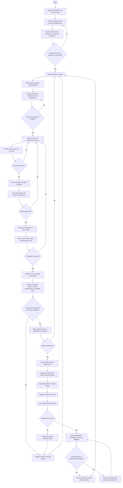

# Software Development Process — Oracle Java Bot

**Process model:** Iterative and incremental Agile process supported by DevOps  
**Version:** 1.0  
**Last updated:** June 12, 2026

---

## 1. Purpose

This document defines the software development process followed by the Oracle Java Bot team, from requirements elicitation through deployment and maintenance. The process combines sprint-based planning, version control in GitHub, quality assurance, continuous integration, OCI deployment, release management, and feedback-driven maintenance.

---

## 2. Process Principles

The team follows these principles:

- Requirements must be understandable, testable, prioritized, and traceable.
- Work is planned and delivered incrementally in sprints.
- Source code and documentation are controlled through Git and GitHub.
- Changes are reviewed before integration into the main branch.
- Testing occurs throughout development, not only before release.
- Deployment artifacts are reproducible and versioned.
- Releases include user documentation and release notes.
- Production incidents and user feedback return to the backlog.

---

## 3. UML Activity Diagram

The following Mermaid diagram can be rendered directly by GitHub.

---

## 4. Process Activities

### 4.1 Requirements

**Objective:** Define what the system must do and the quality conditions it must satisfy.

**Inputs:**

- Stakeholder needs.
- Business objectives.
- Existing system constraints.
- Course or customer requirements.
- Feedback from previous increments.

**Activities:**

1. Identify stakeholders and user roles.
2. Elicit functional and non-functional requirements.
3. Write user stories and acceptance criteria.
4. Define preconditions, postconditions, normal flows, and alternative flows.
5. Prioritize requirements in the product backlog.
6. Review feasibility, dependencies, risks, and security implications.
7. Establish traceability between requirement, task, code change, test, and release.

**Outputs:**

- Approved backlog.
- User stories.
- Acceptance criteria.
- Non-functional requirements.
- Traceability records.

---

### 4.2 Planning

**Objective:** Select achievable work for a sprint and assign responsibility.

**Activities:**

- Review priorities and dependencies.
- Estimate effort.
- Define the sprint goal.
- Select backlog items.
- Break stories into technical tasks.
- Assign owners.
- Define the sprint acceptance and completion criteria.
- Identify risks and required environments.

**Exit criteria:**

- Sprint goal is clear.
- Selected items are estimated and assigned.
- Dependencies and blockers are visible.
- Acceptance criteria are understood.

---

### 4.3 Analysis and Design

**Objective:** Define a solution that satisfies requirements before implementation.

**Activities:**

- Review architecture and integration impacts.
- Model database entities and relationships.
- Design API contracts and user-interface behavior.
- Define security controls and access roles.
- Produce UML, architecture, deployment, or data diagrams where useful.
- Record important decisions as architecture decision records.
- Review the design with relevant team members.

**Outputs:**

- Approved design.
- Updated diagrams.
- API and database decisions.
- Identified test conditions.

---

### 4.4 Development

**Objective:** Implement the approved increment in a controlled and reviewable manner.

**Git workflow:**

1. Update the local base branch.
2. Create a branch associated with a backlog item.
3. Implement the smallest coherent change.
4. Add or update tests.
5. Run local validation.
6. Commit with a descriptive message.
7. Push the branch.
8. Open a pull request.
9. Address review comments.
10. Merge only after approval and successful checks.

**Definition of Done:**

- Acceptance criteria are implemented.
- Code compiles.
- Required tests pass.
- No secret is committed.
- Relevant documentation is updated.
- Pull request is reviewed.
- Traceability is preserved.

---

### 4.5 Verification and Testing

**Objective:** Verify that the product was built correctly and validate that it solves the intended user need.

**Test levels and types:**

- Unit testing.
- Integration testing.
- API testing.
- System and end-to-end testing.
- Functional testing.
- Regression testing.
- Smoke testing.
- Performance and load testing.
- Security testing.
- User acceptance testing.
- Usability and GUI testing.

**Defect process:**

1. Register the defect.
2. Include reproduction steps, evidence, severity, environment, expected result, and actual result.
3. Prioritize the defect.
4. Correct it in a branch.
5. Review and merge the fix.
6. Retest the defect.
7. Execute relevant regression tests.
8. Close only when evidence confirms resolution.

**Test exit criteria:**

- Critical acceptance tests pass.
- No unresolved critical defect remains.
- Required regression tests pass.
- Performance and security risks are acceptable.
- Results and evidence are documented.

---

### 4.6 Continuous Integration

**Objective:** Detect integration problems early and produce a reproducible build.

After a change is integrated, the CI process should:

- Retrieve the approved source revision.
- Install the required Java/build environment.
- Compile frontend and backend components.
- Run automated tests and configured quality checks.
- Build the application package.
- Build a versioned Docker image.
- Publish the image to Oracle Container Registry.
- Preserve logs and build results.
- Stop the release path when a mandatory stage fails.

A failed CI execution returns the item to development for correction.

---

### 4.7 Release Management

**Objective:** Package an approved, traceable, and documented product version.

Each release must include:

- Semantic or agreed version number.
- Git tag.
- Release title and publication date.
- Summary.
- New features.
- Improvements.
- Fixed defects.
- Breaking changes and migration instructions.
- Known issues and workarounds.
- Security notes.
- Upgrade and rollback guidance.
- User-guide update.
- Test and acceptance evidence.
- Approved release artifact.

Release approval is based on acceptance criteria, test exit criteria, deployment readiness, stakeholder acceptance, and known risk.

---

### 4.8 Deployment

**Objective:** make the approved release available in the target OCI environment safely.

**Activities:**

1. Confirm release approval.
2. Verify OCI configuration, secrets, database connectivity, and image version.
3. Deploy the versioned container to the target OKE environment.
4. Verify pods, services, and external access.
5. Execute smoke tests.
6. Monitor logs and health indicators.
7. Communicate release status.
8. Roll back when critical health checks fail.

**Deployment evidence:**

- Pipeline/build identifier.
- Image version.
- deployment date and responsible person.
- Environment.
- smoke-test results.
- incidents or deviations.

---

### 4.9 Operation and Maintenance

**Objective:** Preserve availability, security, correctness, and usefulness after deployment.

**Maintenance categories:**

- Corrective: fixes defects.
- Adaptive: responds to platform, dependency, API, or infrastructure changes.
- Perfective: improves performance, usability, or functionality.
- Preventive: reduces future risk through refactoring, monitoring, testing, and documentation.

**Activities:**

- Monitor application and infrastructure.
- Review logs and alerts.
- Receive user feedback.
- Triage incidents.
- Apply security and dependency updates.
- Back up and protect data.
- Review performance and costs.
- Maintain documentation.
- Add approved defects and improvements to the backlog.

The lifecycle is continuous: maintenance findings become new requirements and begin another iteration.

---

## 5. Roles and Responsibilities

| Role | Main Responsibilities |
|---|---|
| Product Owner/Manager | Prioritizes requirements, clarifies acceptance criteria, and approves increments. |
| Developer | Designs, implements, tests, reviews, and documents changes. |
| QA/Test Responsible | Plans tests, verifies traceability, records evidence, and reports defects. |
| DevOps Responsible | Maintains build/deployment configuration and monitors release execution. |
| Database Responsible | Manages schema, queries, data integrity, connectivity, and backup considerations. |
| Administrator/Support | Manages access, receives incidents, and supports final users. |
| Stakeholder/Final User | Validates usefulness, performs acceptance activities, and provides feedback. |

One team member may perform more than one role, but responsibilities should remain explicit.

---

## 6. Required Work Products

| Phase | Required Evidence |
|---|---|
| Requirements | Backlog, user stories, acceptance criteria, NFRs, traceability. |
| Planning | Sprint goal, selected tasks, estimates, assignments, risks. |
| Design | UML/data/architecture diagrams, API decisions, ADRs. |
| Development | Branches, commits, pull requests, review evidence. |
| Testing | Test cases, results, defect reports, coverage and logs. |
| Release | Version/tag, release notes, approvals, user guide. |
| Deployment | Pipeline logs, image version, environment and smoke tests. |
| Maintenance | Incident records, monitoring evidence, backlog updates. |

---

## 7. Change Control

A requested change is managed as follows:

1. Register the request.
2. Describe its reason, value, urgency, and affected requirement.
3. Analyze scope, schedule, cost, architecture, security, and testing impact.
4. Approve, reject, or defer it.
5. Update the backlog and traceability.
6. Implement it through the normal branch, review, test, release, and deployment flow.
7. Record it in release notes when delivered.

Emergency fixes may use an expedited flow, but still require review, testing, versioning, deployment evidence, and retrospective documentation.

---

## 8. Quality Gates

| Gate | Minimum Condition |
|---|---|
| Requirements Ready | Clear, testable, prioritized, and feasible. |
| Design Ready | Reviewed and consistent with architecture and security needs. |
| Code Ready | Compiles, locally tested, reviewed, and documented. |
| Build Ready | CI checks pass and artifact is reproducible. |
| Release Ready | Acceptance and exit criteria pass; known risks documented. |
| Deployment Ready | Configuration, secrets, rollback, and smoke tests prepared. |
| Maintenance Closure | Incident resolved, verified, documented, and lessons captured. |

---

## 9. Process Metrics

The team may evaluate and improve its process using:

- Percentage of requirements with test coverage.
- Sprint completion rate.
- Escaped defects.
- Defect resolution time.
- Build success rate.
- Deployment success rate.
- Lead time from requirement to production.
- Estimated versus actual hours.
- Completed tasks per sprint.
- Availability and incident frequency.
- User acceptance rate.

Metrics should be used to improve the process, not to punish individual team members.

---

## 10. Continuous Improvement

At the end of each sprint or release, the team conducts a retrospective:

- What worked well?
- What caused delays or defects?
- Which activities should be repeated?
- Which practices should be changed or stopped?
- What measurable improvement will be tested in the next sprint?

Improvement actions are assigned, prioritized, and reviewed in the following iteration.

---

## 11. Document Control

| Version | Date | Description |
|---|---|---|
| 1.0 | June 12, 2026 | Initial documented lifecycle from requirements through deployment and maintenance. |
